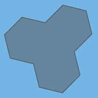
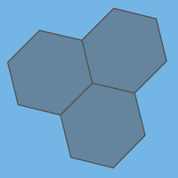

# geojson2h3

[](https://travis-ci.org/uber/geojson2h3) [](https://coveralls.io/github/uber/geojson2h3?branch=master)

The `geojson2h3` library includes a set of utilities for conversion between GeoJSON polygons and [H3 hexagon indexes](https://uber.github.io/h3), using [h3-js](https://github.com/uber/h3-js).

-   Post **bug reports or feature requests** to the [Github Issues page](https://github.com/uber/geojson2h3/issues)
-   Ask **questions** by posting to the [H3 tag on StackOverflow](https://stackoverflow.com/questions/tagged/h3)

## Installation

```
npm install geojson2h3
```

## Example Usage

```
import geojson2h3 from 'geojson2h3';

const polygon = {
  type: 'Feature',
  geometry: {
    type: 'Polygon',
    coordinates: [[
      [-122.47485823276713, 37.85878356045377],
      [-122.47504834087829, 37.86196795698972],
      [-122.47845104316997, 37.86010614563313],
      [-122.47485823276713, 37.85878356045377]
    ]]
  }
};

const hexagons = geojson2h3.featureToH3Set(polygon, 10);
// -> ['8a2830855047fff', '8a2830855077fff', '8a283085505ffff', '8a283085506ffff']

const feature = geojson2h3.h3SetToFeature(hexagons);
// -> {type: 'Feature', properties: {}, geometry: {type: 'Polygon', coordinates: [...]}}
```

## API Reference

<a name="module_geojson2h3"></a>

## geojson2h3

* [geojson2h3](#module_geojson2h3)
    * [.featureToH3Set(feature, resolution)](#module_geojson2h3.featureToH3Set) ⇒ <code>Array.&lt;String&gt;</code>
    * [.h3ToFeature(hexAddress, [properties])](#module_geojson2h3.h3ToFeature) ⇒ <code>Feature</code>
    * [.h3SetToFeature(hexagons, [properties])](#module_geojson2h3.h3SetToFeature) ⇒ <code>Feature</code>
    * [.h3SetToMultiPolygonFeature(hexagons, [properties])](#module_geojson2h3.h3SetToMultiPolygonFeature) ⇒ <code>Feature</code>
    * [.h3SetToFeatureCollection(hexagons, [getProperties])](#module_geojson2h3.h3SetToFeatureCollection) ⇒ <code>FeatureCollection</code>


* * *

<a name="module_geojson2h3.featureToH3Set"></a>

### geojson2h3.featureToH3Set(feature, resolution) ⇒ <code>Array.&lt;String&gt;</code>
Convert a GeoJSON feature to a set of hexagons. Only hexagons whose centers
fall within the feature will be included. Note that conversion from GeoJSON
is lossy; the resulting hexagon set only approximately describes the original
shape, at a level of precision determined by the hexagon resolution.

**Kind**: static method of [<code>geojson2h3</code>](#module_geojson2h3)  
**Returns**: <code>Array.&lt;String&gt;</code> - H3 indexes  

| Param | Type | Description |
| --- | --- | --- |
| feature | <code>Object</code> | Input GeoJSON: type must be either `Feature` or                              `FeatureCollection`, and geometry type must be                              either `Polygon` or `MultiPolygon` |
| resolution | <code>Number</code> | Resolution of hexagons, between 0 and 15 |


* * *

<a name="module_geojson2h3.h3ToFeature"></a>

### geojson2h3.h3ToFeature(hexAddress, [properties]) ⇒ <code>Feature</code>
Convert a single H3 hexagon to a `Polygon` feature

**Kind**: static method of [<code>geojson2h3</code>](#module_geojson2h3)  
**Returns**: <code>Feature</code> - GeoJSON Feature object  

| Param | Type | Description |
| --- | --- | --- |
| hexAddress | <code>String</code> | Hexagon address |
| [properties] | <code>Object</code> | Optional feature properties |


* * *

<a name="module_geojson2h3.h3SetToFeature"></a>

### geojson2h3.h3SetToFeature(hexagons, [properties]) ⇒ <code>Feature</code>
Convert a set of hexagons to a GeoJSON `Feature` with the set outline(s). The
feature's geometry type will be either `Polygon` or `MultiPolygon` depending on
the number of outlines required for the set.



**Kind**: static method of [<code>geojson2h3</code>](#module_geojson2h3)  
**Returns**: <code>Feature</code> - GeoJSON Feature object  

| Param | Type | Description |
| --- | --- | --- |
| hexagons | <code>Array.&lt;String&gt;</code> | Hexagon addresses |
| [properties] | <code>Object</code> | Optional feature properties |


* * *

<a name="module_geojson2h3.h3SetToMultiPolygonFeature"></a>

### geojson2h3.h3SetToMultiPolygonFeature(hexagons, [properties]) ⇒ <code>Feature</code>
Convert a set of hexagons to a GeoJSON `MultiPolygon` feature with the
outlines of each individual hexagon.



**Kind**: static method of [<code>geojson2h3</code>](#module_geojson2h3)  
**Returns**: <code>Feature</code> - GeoJSON Feature object  

| Param | Type | Description |
| --- | --- | --- |
| hexagons | <code>Array.&lt;String&gt;</code> | Hexagon addresses |
| [properties] | <code>Object</code> | Optional feature properties |


* * *

<a name="module_geojson2h3.h3SetToFeatureCollection"></a>

### geojson2h3.h3SetToFeatureCollection(hexagons, [getProperties]) ⇒ <code>FeatureCollection</code>
Convert a set of hexagons to a GeoJSON `FeatureCollection` with each hexagon
in a separate `Polygon` feature with optional properties.


**Kind**: static method of [<code>geojson2h3</code>](#module_geojson2h3)  
**Returns**: <code>FeatureCollection</code> - GeoJSON FeatureCollection object  

| Param | Type | Description |
| --- | --- | --- |
| hexagons | <code>Array.&lt;String&gt;</code> | Hexagon addresses |
| [getProperties] | <code>function</code> | Optional function returning properties                                    for a hexagon: f(hexAddress) => Object |


* * *


## Development

The `geojson2h3` library uses `yarn` as the preferred package manager. To install the dev dependencies, just run:

    yarn

To run the tests in both native ES6 (requires Node >= 6) and transpiled ES5:

    yarn test

To format the code:

    yarn prettier

To rebuild the API documentation in the README file:

    yarn build-docs

## Contributing

Pull requests and [Github issues](https://github.com/uber/geojson2h3/issues) are welcome. Please include tests for new work, and keep the library test coverage at 100%. Before we can merge your changes, you must agree to the [Uber Contributor License Agreement](http://cla-assistant.io/uber/geojson2h3).

## Legal and Licensing

The `geojson2h3` library is licensed under the [Apache 2.0 License](https://github.com/uber/geojson2h3/blob/master/LICENSE).
